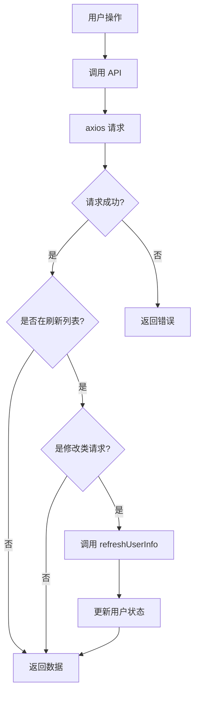

# 用户状态自动刷新功能实现

## 📋 概述

实现了一个完整的用户状态自动刷新系统，在文件上传、删除、用户信息更新等操作后自动调用 API 刷新用户状态。

## 🎯 实现方案

### 1. 核心钩子 (useAuthRefresh)

**位置**: `src/composables/useAuthRefresh.js`

提供四个主要方法：
- `refreshAuth(options)` - 手动刷新用户状态
- `withAuthRefresh(operation, options)` - 包装函数，操作成功或失败后都自动刷新
- `checkAndRefreshAuth()` - 检查并刷新登录状态
- `initUserInfoAfterLogin(token, expiresIn)` - 登录后初始化用户信息

### 2. 全局自动刷新 (request.js)

**位置**: `src/utils/request.js`

在响应拦截器中自动检测需要刷新的 API 请求：

```javascript
const REFRESH_AUTH_PATHS = [
  '/files/upload',      // 文件上传后
  '/files/delete',      // 文件删除后
  '/files/move',        // 文件移动后
  '/api/users/profile', // 用户信息更新后
  '/api/users/avatar',  // 头像更新后
  '/api/auth/oauth2/bindings' // OAuth绑定变更后
]
```

**特点**：
- ✅ 仅在修改类请求（POST/PUT/DELETE/PATCH）后触发
- ✅ 静默刷新，不影响用户体验
- ✅ 失败时不影响主请求
- ✅ 控制台日志提示刷新状态

## 📖 使用方式

### 方式1: 全局自动刷新（推荐）

**无需编写额外代码**，在 `REFRESH_AUTH_PATHS` 中配置的路径会自动刷新：

```javascript
// 只需正常调用 API
await uploadFile(formData)
// 请求成功后会自动刷新用户状态
```

### 方式2: 手动调用

在需要的地方手动调用刷新：

```vue
<script setup>
import { useAuthRefresh } from '@/composables/useAuthRefresh.js'

const { refreshAuth } = useAuthRefresh()

const handleUpdate = async () => {
  await updateUserProfile(data)
  await refreshAuth() // 手动刷新
}
</script>
```

### 方式3: 函数包装

使用 `withAuthRefresh` 包装函数（成功或失败都会刷新）：

```javascript
const { withAuthRefresh } = useAuthRefresh()
const deleteFileWithRefresh = withAuthRefresh(deleteFile)

// 无论成功或失败，都会自动刷新用户状态
await deleteFileWithRefresh(fileId)

// 如果只想在成功时刷新（不推荐）
const deleteFileSuccessOnly = withAuthRefresh(deleteFile, { refreshOnError: false })
```

## 📁 文件清单

| 文件 | 说明 |
|------|------|
| `src/composables/useAuthRefresh.js` | 核心钩子实现 |
| `src/composables/README.md` | 详细使用文档 |
| `src/utils/request.js` | 全局拦截器集成 |
| `src/components/FileOperationsExample.vue` | 示例组件 |

## 🔧 配置说明

### 添加需要自动刷新的 API

编辑 `src/utils/request.js`，在 `REFRESH_AUTH_PATHS` 数组中添加路径：

```javascript
const REFRESH_AUTH_PATHS = [
  '/files/upload',
  '/your/custom/api',  // 添加你的 API
  // ...
]
```

### 调整刷新行为

在钩子调用时传入配置：

```javascript
// 显示成功消息
await refreshAuth({ showSuccess: true })

// 显示错误消息
await refreshAuth({ silent: false })
```

## ⚙️ 工作原理



## 🎨 适用场景

- ✅ 文件上传/删除后更新存储空间
- ✅ 用户信息修改后更新显示
- ✅ 权限变更后更新权限状态
- ✅ OAuth 绑定后更新账号信息
- ✅ 操作失败后仍需同步状态（如并发操作导致的失败）
- ✅ 任何需要同步用户状态的操作

## 💡 最佳实践

1. **优先使用全局自动刷新**：配置 `REFRESH_AUTH_PATHS` 即可
2. **特殊场景手动刷新**：需要控制刷新时机时使用钩子
3. **批量操作优化**：使用 `withAuthRefresh` 包装，成功失败都刷新
4. **错误处理**：即使操作失败也会刷新用户状态，确保数据一致性
4. **错误处理**：刷新失败不影响主业务逻辑

## 🔍 调试

查看浏览器控制台：
```
🔄 用户状态已自动刷新  // 成功刷新
自动刷新用户状态失败: ... // 刷新失败（不影响主请求）
```

## 📝 注意事项

1. 钩子调用 `userStore.refreshUserInfo()` 获取最新用户信息
2. 全局刷新仅在修改类请求成功后触发
3. `withAuthRefresh` 默认在操作成功或失败后都会刷新，可配置 `refreshOnError: false` 仅在成功时刷新
4. 刷新操作是异步的，不会阻塞主请求返回
5. 如果不想使用全局刷新，将 `REFRESH_AUTH_PATHS` 设为空数组

## 🚀 快速开始

1. 直接使用，无需配置（已内置常用路径）
2. 如需添加自定义 API，编辑 `REFRESH_AUTH_PATHS`
3. 特殊场景参考 `src/composables/README.md`

## 📚 更多示例

查看完整示例：
- 详细文档: `src/composables/README.md`
- 示例组件: `src/components/FileOperationsExample.vue`
